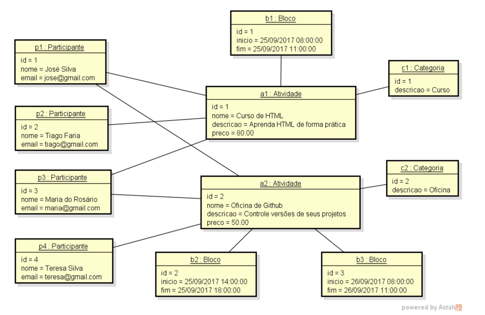

# Desafio: Modelo de Domínio e ORM

Este projeto foi desenvolvido como parte da formação **Desenvolvedor Moderno** (DevSuperior).
O objetivo é implementar um **sistema de gerenciamento de evento acadêmico** usando **Spring Boot** com **JPA/Hibernate** e banco de dados **H2**.

## Descrição do Sistema

O sistema gerencia informações de **participantes** e **atividades** de um evento.

* Uma **atividade** possui:

    * Nome
    * Descrição
    * Preço
    * Blocos de horários (dia, hora de início, hora de fim)

* Um **participante** possui:

    * Nome
    * Email

* Um **participante** pode se inscrever em várias atividades, e uma atividade pode ter vários participantes (relação *N*\*:N\*).

---

## 🏗️ Modelo de Domínio




---

## ⚙️ Tecnologias Utilizadas

* **Java 21**
* **Spring Boot**
* **Spring Data JPA / Hibernate**
* **Banco de dados H2**
* **Maven**

---

## 🚀 Como Executar o Projeto

```bash
# Clonar o repositório
git clone https://github.com/thiagosohsa/desafio-modelo-de-dominio-e-orm.git

# Entrar na pasta do projeto
cd desafio-modelo-de-dominio-e-orm

# Executar com Maven
./mvnw spring-boot:run
```

Após rodar, acesse o **H2 Console**:

* URL: `http://localhost:8080/h2-console`
* JDBC URL: `jdbc:h2:mem:testdb`
* Usuário: `sa`
* Senha: *(em branco)*


## 💾 Seeding da Base de Dados

O projeto já vem com instâncias de dados (seeding) carregadas automaticamente.

```sql
INSERT INTO tb_categoria(descricao) VALUES ('Curso');
INSERT INTO tb_categoria(descricao) VALUES ('Oficina');

INSERT INTO tb_atividade(nome,descricao,preco,categoria_id) VALUES ('Curso de HTML','Aprenda HTML de forma prática',80.00,1);
INSERT INTO tb_atividade(nome,descricao,preco,categoria_id) VALUES ('Oficina ded Github','Controle versões de seus projetos',50.00,2);

INSERT INTO tb_bloco(inicio,fim,atividade_id) VALUES (TIMESTAMP WITHOUT TIME ZONE '2017-09-25T08:00:00', TIMESTAMP WITHOUT TIME ZONE '2017-09-25T11:00:00', 1);
INSERT INTO tb_bloco(inicio,fim,atividade_id) VALUES (TIMESTAMP WITHOUT TIME ZONE '2017-09-25T14:00:00', TIMESTAMP WITHOUT TIME ZONE '2017-09-25T18:00:00', 2);
INSERT INTO tb_bloco(inicio,fim,atividade_id) VALUES (TIMESTAMP WITHOUT TIME ZONE '2017-09-26T08:00:00', TIMESTAMP WITHOUT TIME ZONE '2017-09-26T11:00:00', 2);

INSERT INTO tb_participante(nome,email) VALUES ('José Silva','jose@email.com');
INSERT INTO tb_participante(nome,email) VALUES ('Tiago Faria','tiago@email.com');
INSERT INTO tb_participante(nome,email) VALUES ('Maria do Rosário','maria@email.com');
INSERT INTO tb_participante(nome,email) VALUES ('Teresa Silva','teresa@email.com');

INSERT INTO tb_participante_atividade(participante_id,atividade_id) VALUES (1,1);
INSERT INTO tb_participante_atividade(participante_id,atividade_id) VALUES (1,2);
INSERT INTO tb_participante_atividade(participante_id,atividade_id) VALUES (2,1);
INSERT INTO tb_participante_atividade(participante_id,atividade_id) VALUES (3,1);
INSERT INTO tb_participante_atividade(participante_id,atividade_id) VALUES (3,2);
INSERT INTO tb_participante_atividade(participante_id,atividade_id) VALUES (4,2);
```